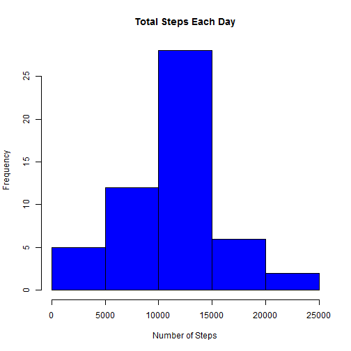

## Loading and preprocessing the data

Download, unzip and load data into data frame - data


```r
if(!file.exists("getdata-projectfiles-UCI HAR Dataset.zip")) {
        temp <- tempfile()
        download.file("http://d396qusza40orc.cloudfront.net/repdata%2Fdata%2Factivity.zip",temp)
        unzip(temp)
        unlink(temp)
}

data <- read.csv("activity.csv")
```

## What is mean total number of steps taken per day?

Ignore missing values in dataset and Sum steps by day, create Histogram of the total number of steps taken each day.


```r
steps_by_day <- aggregate(steps ~ date, data, sum)
hist(steps_by_day$steps, main = paste("Total Steps Each Day"), col="blue", xlab="Number of Steps")
```

 

Calculate mean and median of the total number of steps taken per day.


```r
rmean <- mean(steps_by_day$steps)
rmean # print value to console
```

```
## [1] 10766.19
```

```r
rmedian <- median(steps_by_day$steps)
rmedian # print value to console
```

```
## [1] 10765
```

The mean is 1.0766 × 10^4 and the median is 10765.

## What is the average daily activity pattern?
Make a time series plot (i.e. type = "l") of the 5-minute interval (x-axis) and the average number of steps taken, averaged across all days (y-axis).
- Calculate average steps for each interval for all days.
- Plot the Average Number Steps per Day by Interval.


```r
steps_by_interval <- aggregate(steps ~ interval, data, mean)
head(steps_by_interval) # print value to console
```

```
##   interval     steps
## 1        0 1.7169811
## 2        5 0.3396226
## 3       10 0.1320755
## 4       15 0.1509434
## 5       20 0.0754717
## 6       25 2.0943396
```

```r
plot(steps_by_interval$interval,steps_by_interval$steps, type="l", xlab="Interval", 
     ylab="Number of Steps",main="Average Number of Steps per Day by Interval")
```

 

Find interval with most average steps.


```r
max_interval <- steps_by_interval[which.max(steps_by_interval$steps),1]
max_interval # print value to console
```

```
## [1] 835
```

The 5-minute interval, on average across all the days in the dataset, containing the maximum number of steps is 835.

## Imputing missing values

Note that there are a number of days/intervals where there are missing values (coded as NA). The presence of missing days may introduce bias into some calculations or summaries of the data. In this case, missing data needed to be imputed by inserting the mean for each 5-minute interval. Thus, if interval 10 was missing on 10-02-2012, the average for that interval for all days (0.1320755) is used to replace the NA.


```r
# Calculate total number of missing values in the dataset (i.e. the total number of rows with NAs)
incomplete <- sum(!complete.cases(data)) 
incomplete #print value to console
```

```
## [1] 2304
```

```r
# Create a new dataset that is equal to the original dataset
imputed_data <- transform(data, 
                          steps = ifelse(is.na(data$steps), 
                                         steps_by_interval$steps[match(data$interval, 
                                                                       steps_by_interval$interval)], 
                                         data$steps)) 
```

```
## Error in match(data$interval, steps_by_interval$interval): unused argument (steps_by_interval$interval)
```

Zeroes were imputed for 10-01-2012 because it was the first day and would have been over 9,000 steps higher than the following day, which had only 126 steps. NAs then were assumed to be zeros to fit the rising trend of the data.


```r
imputed_data[as.character(imputed_data$date) == "2012-10-01", 1] <- 0
```

Recount total steps by day and create Histogram.


```r
steps_by_day_i <- aggregate(steps ~ date, imputed_data, sum)
hist(steps_by_day_i$steps, main = paste("Total Steps Each Day"), 
     col="blue", xlab="Number of Steps")

#Create Histogram to show difference. 
hist(steps_by_day$steps, main = paste("Total Steps Each Day"), col="lightskyblue", 
     xlab="Number of Steps", add=T)
legend("topright", c("Imputed", "Non-imputed"), col=c("blue", "lightskyblue"), lwd=10)
```

 

Calculate new mean and median for imputed data.


```r
rmean.i <- mean(steps_by_day_i$steps)
rmean.i # print value to console
```

```
## [1] 10589.69
```

```r
rmedian.i <- median(steps_by_day_i$steps)
rmedian.i # print value to console
```

```
## [1] 10766.19
```

Calculate total difference.


```r
total_diff <- sum(steps_by_day_i$steps) - sum(steps_by_day$steps)
total_diff # print values to console
```

```
## [1] 75363.32
```

- The imputed data mean is 1.059 × 10^4
- The imputed data median is 1.0766 × 10^4
- The difference between the non-imputed mean and imputed mean is -176.4949
- The difference between the non-imputed mean and imputed mean is 1.1887
- The difference between total number of steps between imputed and non-imputed data is 7.5363 × 10^4. Hence, there were 7.5363 × 10^4 more steps in the imputed data.

## Are there differences in activity patterns between weekdays and weekends?

Created a plot to compare and contrast number of steps between the week and weekend. 


```r
# Create a new factor variable 'dow'in the dataset with two levels - "weekday" and "weekend" 
# indicating whether a given date is a weekday or weekend day.
weekdays <- c("Monday", "Tuesday", "Wednesday", "Thursday", 
              "Friday")
imputed_data$dow = as.factor(ifelse(is.element(weekdays(as.Date(imputed_data$date)),
                                               weekdays), "Weekday", "Weekend")) 

steps_by_interval_i <- aggregate(steps ~ interval + dow, imputed_data, mean)

library(lattice)

# Make a panel plot containing a time series plot (i.e. type = "l")
# of the 5-minute interval (x-axis) and the average number of steps taken, 
# averaged across all weekday days or weekend days (y-axis).
xyplot(steps_by_interval_i$steps ~ steps_by_interval_i$interval|steps_by_interval_i$dow, 
       main="Average Steps per Day by Interval",xlab="Interval", 
       ylab="Steps",layout=c(1,2), type="l")
```

 

There is a higher peak earlier on weekdays, and more overall activity on weekends.
